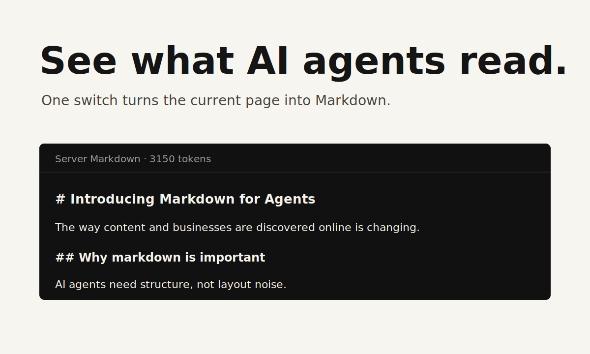

# Agent View

## Markdown for Agents Chrome Extension

See the current page as an AI agent reads it.

Agent View is a tiny Chrome extension inspired by Cloudflare's Markdown for Agents release. It requests the current URL with `Accept: text/markdown`, then shows the Markdown response in a clean full-page view. If the site does not return Markdown, Agent View says so.



## Install from GitHub

1. Download this repository.
2. Open `chrome://extensions`.
3. Enable Developer mode.
4. Click Load unpacked.
5. Select `extension`.
6. Pin Agent View in the toolbar.

Chrome Web Store release will use the same extension package from this repo.

## Why this exists

Cloudflare's article argues that AI agents should not waste tokens parsing navigation, wrappers, scripts, and layout markup. A page from the article was 16,180 tokens as HTML and 3,150 tokens as Markdown. The important product insight is simple:

> If agents read Markdown, humans need a way to inspect that Markdown.

Source: https://blog.cloudflare.com/markdown-for-agents/

## Use

Open any webpage. Click the Agent View icon. Flip the switch.

The extension shows:

- Server Markdown, when the site responds to `Accept: text/markdown`.
- No Markdown response, when the site only serves HTML.
- Token count, when the server sends `x-markdown-tokens`.
- Content Signals, when the server sends `content-signal`.

## Package

```bash
npm run validate
npm run zip
```

The packaged extension is written to `dist/agent-view-extension.zip`.

## Store Assets

Chrome Web Store upload assets are in `store-assets/`:

- `screenshot-1280x800.png`
- `screenshot-640x400.png`
- `small-promo-440x280.png`
- `marquee-promo-1400x560.png`

All are 24-bit PNG files without alpha.

## Chrome Web Store

Name: `Agent View: Markdown for Agents`

Summary: `See the Markdown a website actually gives to AI agents.`

Description:

```text
Agent View shows the current webpage in the format AI agents request: Markdown.

Open a page, click the extension, and turn on Agent View. The extension requests the page with Accept: text/markdown. If the website supports Markdown for Agents, you see the source-provided Markdown. If it does not, Agent View shows that no Markdown response was provided.

Use it to audit AI SEO, test Cloudflare Markdown for Agents, and verify whether your site actually serves agent-readable Markdown.
```

Search phrases:

- Markdown for Agents Chrome extension
- AI agent view Chrome extension
- view website as AI agent
- Accept text markdown Chrome extension
- AI SEO Markdown viewer

## Product position

Primary search phrase: `Markdown for Agents Chrome extension`.

Promise: `See the Markdown your site gives agents.`

Audience:

- AI SEO consultants checking if pages are agent-readable.
- Developers implementing Markdown for Agents.
- Content teams auditing how their pages appear to AI crawlers.

## Files

- `extension/manifest.json` - Chrome MV3 manifest.
- `extension/background.js` - Fetches the current URL with Markdown-friendly headers.
- `extension/content.js` - Displays the full-page Agent View.
- `extension/popup.html` - One-switch popup UI.
- `MARKETING.md` - positioning, channels, and launch plan.
